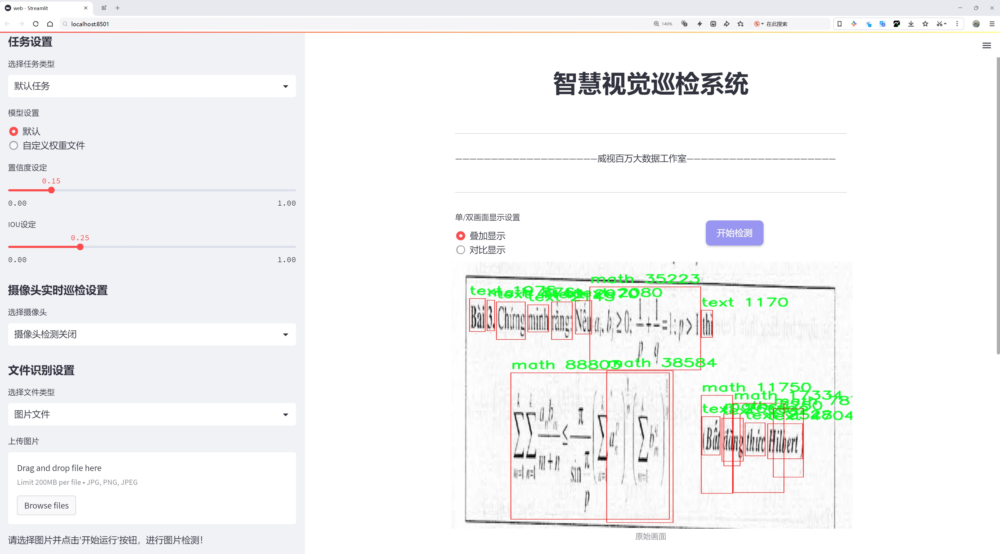

# 数学公式检测检测系统源码分享
 # [一条龙教学YOLOV8标注好的数据集一键训练_70+全套改进创新点发刊_Web前端展示]

### 1.研究背景与意义

项目参考[AAAI Association for the Advancement of Artificial Intelligence](https://gitee.com/qunshansj/projects)

项目来源[AACV Association for the Advancement of Computer Vision](https://gitee.com/qunmasj/projects)

研究背景与意义

随着信息技术的迅猛发展，尤其是在人工智能和计算机视觉领域，物体检测技术的应用越来越广泛，涵盖了从自动驾驶到安防监控、从智能制造到医疗影像等多个领域。YOLO（You Only Look Once）系列模型因其高效的实时检测能力而受到广泛关注，尤其是YOLOv8作为最新版本，进一步提升了检测精度和速度。然而，针对特定领域的物体检测，尤其是数学公式的识别，仍然面临着诸多挑战。数学公式通常包含复杂的符号、结构和排版，这使得传统的物体检测模型难以有效处理。因此，基于改进YOLOv8的数学公式检测系统的研究具有重要的学术价值和实际意义。

本研究将利用一个包含4500张图像的特定数据集，涵盖了五个类别：未知、图示、标题、数学和文本。这些类别的划分不仅为模型的训练提供了丰富的样本，也为后续的应用场景奠定了基础。数学公式的检测与识别，作为一种特殊的文本识别任务，要求模型能够理解和解析复杂的符号组合与结构关系。通过对YOLOv8模型的改进，结合数据集中的多样化样本，旨在提升模型对数学公式的识别能力，进而推动教育、科研等领域的智能化发展。

在教育领域，数学公式的自动识别和处理可以极大地提高教学效率和学习体验。教师可以利用该系统快速生成数学题库，学生则可以通过智能工具进行自主学习和练习。此外，在科研领域，数学公式的准确识别对于文献的自动化处理、知识图谱的构建等都有着重要的意义。通过将改进后的YOLOv8模型应用于这些场景，能够有效提升信息获取的效率，推动学术研究的进展。

此外，随着大数据和深度学习技术的不断发展，如何处理和分析海量的图像数据成为一个亟待解决的问题。基于改进YOLOv8的数学公式检测系统不仅能够为数学公式的识别提供新的思路和方法，也为图像数据的智能分析提供了可行的解决方案。通过对模型的不断优化和调整，研究者可以探索更为高效的算法，进而推动物体检测技术的进一步发展。

综上所述，基于改进YOLOv8的数学公式检测系统的研究，不仅在理论上丰富了物体检测的研究内容，也在实践中为教育和科研等领域提供了切实可行的解决方案。通过对数学公式的精准识别与处理，能够有效提升相关领域的工作效率和研究水平，为未来的智能化发展奠定坚实的基础。

### 2.图片演示




##### 注意：由于此博客编辑较早，上面“2.图片演示”和“3.视频演示”展示的系统图片或者视频可能为老版本，新版本在老版本的基础上升级如下：（实际效果以升级的新版本为准）

  （1）适配了YOLOV8的“目标检测”模型和“实例分割”模型，通过加载相应的权重（.pt）文件即可自适应加载模型。

  （2）支持“图片识别”、“视频识别”、“摄像头实时识别”三种识别模式。

  （3）支持“图片识别”、“视频识别”、“摄像头实时识别”三种识别结果保存导出，解决手动导出（容易卡顿出现爆内存）存在的问题，识别完自动保存结果并导出到tempDir中。

  （4）支持Web前端系统中的标题、背景图等自定义修改，后面提供修改教程。

  另外本项目提供训练的数据集和训练教程,暂不提供权重文件（best.pt）,需要您按照教程进行训练后实现图片演示和Web前端界面演示的效果。

### 3.视频演示

[3.1 视频演示](https://www.bilibili.com/video/BV1YC4qepEZx/)

### 4.数据集信息展示

##### 4.1 本项目数据集详细数据（类别数＆类别名）

nc: 5
names: ['Unknown', 'diagram', 'header', 'math', 'text']


##### 4.2 本项目数据集信息介绍

数据集信息展示

在构建和优化改进YOLOv8的数学公式检测系统的过程中，数据集的选择和构建至关重要。本研究所采用的数据集名为“bigdog”，它为模型的训练和验证提供了丰富的样本和多样化的类别信息。该数据集包含五个主要类别，分别是“Unknown”、“diagram”、“header”、“math”和“text”。这些类别的设计旨在涵盖数学公式和相关文本的不同表现形式，以确保模型能够在各种场景下进行有效的检测和识别。

首先，类别“Unknown”用于标识那些无法明确归类的图像。这一类别的存在是为了增强模型的鲁棒性，使其能够处理不确定性和噪声数据。这在实际应用中尤为重要，因为在真实世界的文档中，常常会遇到不符合预期格式的内容。通过将这些样本纳入训练，模型能够学习到如何应对复杂的输入，减少误检率。

其次，类别“diagram”主要涵盖各种数学图示和图表。这些图示在数学表达中起着重要的辅助作用，能够帮助理解复杂的概念和关系。通过对这一类别的训练，模型将能够识别出不同类型的图示，如函数图像、几何图形和流程图等，从而为数学公式的解析提供更为全面的上下文信息。

接下来，类别“header”包含文档中的标题和章节标题等重要信息。这些信息通常为文档的结构提供了线索，帮助模型在处理长文本时更好地理解内容的层次和逻辑关系。通过识别标题，模型不仅能够提高对数学公式的定位精度，还能在需要时快速跳转到相关内容，提高处理效率。

类别“math”则是本数据集的核心，专注于各种数学公式和表达式的检测。这一类别包括了从简单的算术运算到复杂的微积分公式的广泛内容。通过对这一类别的深入学习，模型能够掌握不同数学符号和结构的特征，从而实现高效的公式识别和解析。这一能力对于教育、科研和工程等领域的应用尤为重要，能够极大地提升文档处理的智能化水平。

最后，类别“text”涵盖了文档中的普通文本信息。这一类别的存在使得模型能够处理数学公式以外的内容，确保在综合分析文档时不遗漏任何关键信息。通过对文本的识别，模型能够在理解数学公式的同时，获取与之相关的背景信息和说明，从而实现更为智能的文档分析。

综上所述，数据集“bigdog”通过精心设计的五个类别，为改进YOLOv8的数学公式检测系统提供了坚实的基础。每个类别的独特性和重要性不仅增强了模型的学习能力，也为其在实际应用中的表现奠定了良好的基础。通过充分利用这一数据集，研究人员能够推动数学公式检测技术的发展，进而为相关领域的智能化进程贡献力量。


### 5.全套项目环境部署视频教程（零基础手把手教学）

[5.1 环境部署教程链接（零基础手把手教学）](https://www.ixigua.com/7404473917358506534?logTag=c807d0cbc21c0ef59de5)


[5.2 安装Python虚拟环境创建和依赖库安装视频教程链接（零基础手把手教学）](https://www.ixigua.com/7404474678003106304?logTag=1f1041108cd1f708b01a)

### 6.手把手YOLOV8训练视频教程（零基础小白有手就能学会）

[6.1 手把手YOLOV8训练视频教程（零基础小白有手就能学会）](https://www.ixigua.com/7404477157818401292?logTag=d31a2dfd1983c9668658)

### 7.70+种全套YOLOV8创新点代码加载调参视频教程（一键加载写好的改进模型的配置文件）

[7.1 70+种全套YOLOV8创新点代码加载调参视频教程（一键加载写好的改进模型的配置文件）](https://www.ixigua.com/7404478314661806627?logTag=29066f8288e3f4eea3a4)

### 8.70+种全套YOLOV8创新点原理讲解（非科班也可以轻松写刊发刊，V10版本正在科研待更新）

由于篇幅限制，每个创新点的具体原理讲解就不一一展开，具体见下列网址中的创新点对应子项目的技术原理博客网址【Blog】：


[8.1 70+种全套YOLOV8创新点原理讲解链接](https://gitee.com/qunmasj/good)

### 9.系统功能展示（检测对象为举例，实际内容以本项目数据集为准）

图9.1.系统支持检测结果表格显示

  图9.2.系统支持置信度和IOU阈值手动调节

  图9.3.系统支持自定义加载权重文件best.pt(需要你通过步骤5中训练获得)

  图9.4.系统支持摄像头实时识别

  图9.5.系统支持图片识别

  图9.6.系统支持视频识别

  图9.7.系统支持识别结果文件自动保存

  图9.8.系统支持Excel导出检测结果数据


### 10.原始YOLOV8算法原理

原始YOLOv8算法原理

YOLOv8作为YOLO系列的最新一代目标检测算法，承载着对实时目标检测技术的进一步探索与创新。其设计理念不仅继承了YOLO系列的优良传统，还在多方面进行了重要的改进，使其在检测精度和速度上都表现出色。YOLOv8的架构由输入端、主干网络、Neck端和输出端四个主要模块组成，各模块之间通过精心设计的连接方式实现了高效的信息流动和特征融合。

在输入端，YOLOv8采用了一系列先进的数据增强技术，如Mosaic数据增强、自适应图片缩放和灰度填充等。这些技术不仅提高了模型对不同场景的适应能力，还增强了训练数据的多样性，使得模型在面对复杂环境时能够更好地进行特征学习。通过这些预处理手段，YOLOv8能够有效减少输入数据的噪声，提升后续特征提取的质量。

主干网络是YOLOv8的核心部分，其设计依然基于跨级结构（Cross Stage Partial, CSP）的思想，但在具体实现上进行了优化。YOLOv8用更轻量的结构替代了YOLOv5中的C3模块，同时保留了空间金字塔池化（SPPF）模块，以实现更高效的特征提取。主干网络通过卷积和池化等操作，提取出图像的多层次特征，并为后续的目标检测提供丰富的信息基础。

在Neck端，YOLOv8引入了PAN（Path Aggregation Network）结构，通过上采样、下采样和特征拼接的方式，将不同尺度的特征图进行融合。这种特征融合策略使得YOLOv8能够在处理多尺度目标时表现出色，尤其是在面对小目标时，能够有效提升其检测能力。Neck端的设计旨在确保信息在不同层次之间的有效传递，从而增强模型的整体性能。

输出端采用了解耦合头结构，将分类和回归过程分开处理。这一设计不仅提高了模型的灵活性，还允许更精确的样本匹配。YOLOv8使用Task-Aligned Assigner方法，对分类分数和回归分数进行加权，从而优化正样本的匹配过程。损失计算方面，YOLOv8采用了BCE（Binary Cross-Entropy）作为分类损失，并结合DFL（Distribution Focal Loss）和CIoU（Complete Intersection over Union）损失函数进行回归损失的计算。这种损失策略的引入，使得YOLOv8在目标检测任务中能够更好地平衡精度与召回率。

YOLOv8的另一个显著特点是其采用了anchor-free的方法，这一创新相较于传统的anchor-based检测方法，显著提高了检测精度和速度。通过去除锚框的设计，YOLOv8能够更加灵活地适应不同形状和大小的目标，尤其是在复杂背景下的小目标检测中表现出色。然而，在复杂水面环境等特定场景中，YOLOv8仍然面临着定位误差和对小目标感知能力不足的问题。这些问题的存在，促使研究者们对YOLOv8进行进一步的改进与优化。

为了解决YOLOv8在特定环境下的不足，研究者们提出了YOLOv8-WSSOD算法。在这一改进版本中，首先引入了捕获远程依赖的思想，采用BiFormer双层路由注意力机制构建C2fBF模块，以减轻主干网络下采样过程中的噪声影响。这一设计不仅保留了特征提取过程中更细粒度的上下文信息，还提升了模型对复杂场景的适应能力。

其次，为了应对小目标漏检的问题，YOLOv8-WSSOD在网络中添加了一个更小的检测头，显著提升了模型对小目标的感知能力。此外，在Neck端引入GSConv和Slim-neck技术，旨在保持模型的检测精度的同时，降低计算量。这一系列的改进，使得YOLOv8-WSSOD在处理小目标时表现得更加出色，能够有效提升检测的准确性。

最后，YOLOv8-WSSOD还对损失函数进行了优化，使用MPDIoU损失函数替代了CIoU损失函数。这一改进不仅提高了模型的泛化能力，还进一步提升了检测的精准度，使得YOLOv8-WSSOD在多种复杂场景下都能保持良好的性能。

综上所述，YOLOv8作为一款先进的目标检测算法，通过一系列创新设计和优化，展现了其在目标检测领域的强大潜力。尽管在特定环境下仍存在一些挑战，但随着YOLOv8-WSSOD等改进版本的提出，未来的目标检测技术将更加精准和高效，为各类应用场景提供更为可靠的解决方案。


### 11.项目核心源码讲解（再也不用担心看不懂代码逻辑）

#### 11.1 ui.py

以下是经过简化和注释的核心代码部分：

```python
import sys
import subprocess
from QtFusion.path import abs_path

def run_script(script_path):
    """
    使用当前 Python 环境运行指定的脚本。

    Args:
        script_path (str): 要运行的脚本路径
    """
    # 获取当前 Python 解释器的路径
    python_path = sys.executable

    # 构建运行命令，使用 streamlit 运行指定的脚本
    command = f'"{python_path}" -m streamlit run "{script_path}"'

    # 执行命令并获取结果
    result = subprocess.run(command, shell=True)
    
    # 检查命令执行是否成功
    if result.returncode != 0:
        print("脚本运行出错。")

# 主程序入口
if __name__ == "__main__":
    # 获取要运行的脚本的绝对路径
    script_path = abs_path("web.py")

    # 调用函数运行脚本
    run_script(script_path)
```

### 代码注释说明：
1. **导入模块**：
   - `sys`：用于获取当前 Python 解释器的路径。
   - `subprocess`：用于执行外部命令。
   - `abs_path`：从 `QtFusion.path` 模块导入的函数，用于获取文件的绝对路径。

2. **`run_script` 函数**：
   - 该函数接受一个脚本路径作为参数，并使用当前 Python 环境运行该脚本。
   - `python_path`：获取当前 Python 解释器的路径。
   - `command`：构建一个命令字符串，使用 `streamlit` 模块运行指定的脚本。
   - `subprocess.run`：执行构建的命令，并将结果存储在 `result` 中。
   - 检查 `result.returncode`，如果不为 0，表示脚本运行出错，打印错误信息。

3. **主程序入口**：
   - `if __name__ == "__main__":`：确保只有在直接运行该脚本时才会执行以下代码。
   - `script_path`：获取要运行的脚本 `web.py` 的绝对路径。
   - 调用 `run_script` 函数，传入脚本路径以执行。

这个文件是一个 Python 脚本，主要用于运行另一个名为 `web.py` 的脚本。它通过调用当前 Python 环境中的 Streamlit 库来启动一个 Web 应用。文件的开头部分导入了必要的模块，包括 `sys`、`os` 和 `subprocess`，以及一个自定义的路径处理函数 `abs_path`。

在 `run_script` 函数中，首先获取当前 Python 解释器的路径，这样可以确保在正确的环境中运行脚本。接着，构建一个命令字符串，该命令使用 Streamlit 来运行指定的脚本。具体来说，命令的格式是 `python -m streamlit run "script_path"`，其中 `script_path` 是传入的参数。

使用 `subprocess.run` 方法执行这个命令，并通过 `shell=True` 参数允许在 shell 中执行命令。执行后，检查返回的状态码，如果不为零，表示脚本运行出错，并打印出错信息。

在文件的最后部分，使用 `if __name__ == "__main__":` 语句来确保只有在直接运行该脚本时才会执行后面的代码。在这里，指定了要运行的脚本路径为 `web.py`，并调用 `run_script` 函数来启动这个脚本。

总体来说，这个文件的功能是为了方便地在当前 Python 环境中运行一个 Streamlit Web 应用，确保路径的正确性并处理可能的错误。

#### 11.2 code\ultralytics\models\yolo\segment\predict.py

以下是代码中最核心的部分，并附上详细的中文注释：

```python
from ultralytics.engine.results import Results  # 导入结果处理类
from ultralytics.models.yolo.detect.predict import DetectionPredictor  # 导入检测预测类
from ultralytics.utils import DEFAULT_CFG, ops  # 导入默认配置和操作工具

class SegmentationPredictor(DetectionPredictor):
    """
    扩展自 DetectionPredictor 类，用于基于分割模型的预测。
    """

    def __init__(self, cfg=DEFAULT_CFG, overrides=None, _callbacks=None):
        """初始化 SegmentationPredictor，设置配置、覆盖参数和回调函数。"""
        super().__init__(cfg, overrides, _callbacks)  # 调用父类构造函数
        self.args.task = "segment"  # 设置任务类型为分割

    def postprocess(self, preds, img, orig_imgs):
        """对每个输入图像的预测结果进行后处理，包括非极大值抑制和掩膜处理。"""
        # 应用非极大值抑制，过滤掉低置信度的检测框
        p = ops.non_max_suppression(
            preds[0],  # 预测结果
            self.args.conf,  # 置信度阈值
            self.args.iou,  # IOU 阈值
            agnostic=self.args.agnostic_nms,  # 是否使用无类别的 NMS
            max_det=self.args.max_det,  # 最大检测框数量
            nc=len(self.model.names),  # 类别数量
            classes=self.args.classes,  # 指定的类别
        )

        # 如果输入图像不是列表，则将其转换为 numpy 数组
        if not isinstance(orig_imgs, list):
            orig_imgs = ops.convert_torch2numpy_batch(orig_imgs)

        results = []  # 存储结果的列表
        proto = preds[1][-1] if len(preds[1]) == 3 else preds[1]  # 获取掩膜原型

        # 遍历每个预测结果
        for i, pred in enumerate(p):
            orig_img = orig_imgs[i]  # 获取原始图像
            img_path = self.batch[0][i]  # 获取图像路径
            
            if not len(pred):  # 如果没有检测到目标
                masks = None  # 掩膜设置为 None
            elif self.args.retina_masks:  # 如果使用 Retina 掩膜
                # 将检测框坐标缩放到原始图像尺寸
                pred[:, :4] = ops.scale_boxes(img.shape[2:], pred[:, :4], orig_img.shape)
                # 处理掩膜
                masks = ops.process_mask_native(proto[i], pred[:, 6:], pred[:, :4], orig_img.shape[:2])  # HWC
            else:  # 否则使用普通掩膜处理
                masks = ops.process_mask(proto[i], pred[:, 6:], pred[:, :4], img.shape[2:], upsample=True)  # HWC
                # 缩放检测框坐标
                pred[:, :4] = ops.scale_boxes(img.shape[2:], pred[:, :4], orig_img.shape)
            
            # 将结果存储到 Results 对象中
            results.append(Results(orig_img, path=img_path, names=self.model.names, boxes=pred[:, :6], masks=masks))
        
        return results  # 返回处理后的结果
```

### 代码说明：
1. **类 SegmentationPredictor**：继承自 `DetectionPredictor`，用于处理分割任务的预测。
2. **构造函数 `__init__`**：初始化时设置任务类型为“segment”。
3. **方法 `postprocess`**：对模型的预测结果进行后处理，包括非极大值抑制、坐标缩放和掩膜处理，最终返回包含原始图像、路径、类别名称、检测框和掩膜的结果列表。

这个程序文件定义了一个名为 `SegmentationPredictor` 的类，它是从 `DetectionPredictor` 类扩展而来的，主要用于基于分割模型进行预测。该类的设计旨在处理图像分割任务，能够对输入的图像进行处理并返回分割结果。

在文件的开头，导入了一些必要的模块和类，包括 `Results`、`DetectionPredictor` 和一些工具函数 `ops`。这些导入的内容为后续的类定义和方法实现提供了基础。

`SegmentationPredictor` 类的构造函数 `__init__` 接受三个参数：`cfg`（配置），`overrides`（覆盖配置），和 `_callbacks`（回调函数）。在构造函数中，首先调用父类的构造函数以初始化继承的属性，然后将任务类型设置为 "segment"，表示该预测器将用于图像分割。

类中最重要的方法是 `postprocess`，该方法用于对模型的预测结果进行后处理。具体来说，它接收三个参数：`preds`（模型的预测结果）、`img`（输入图像）和 `orig_imgs`（原始图像）。在这个方法中，首先调用 `ops.non_max_suppression` 函数对预测结果进行非极大值抑制，以减少重叠的检测框。接着，检查输入的原始图像是否为列表，如果不是，则将其转换为 NumPy 数组。

然后，方法会根据预测结果的长度来决定如何处理掩码。如果没有检测到任何目标，掩码将被设置为 `None`。如果设置了 `retina_masks`，则使用原生的掩码处理函数；否则，使用标准的掩码处理函数。无论哪种情况，都会对检测框进行缩放，以适应原始图像的尺寸。

最后，方法将处理后的结果存储在 `results` 列表中，每个结果都包含原始图像、图像路径、类别名称、检测框和掩码。最终，`postprocess` 方法返回这个结果列表。

总体而言，这个文件实现了一个功能强大的图像分割预测器，能够对输入图像进行处理并返回相应的分割结果，适用于各种图像分割任务。

#### 11.3 70+种YOLOv8算法改进源码大全和调试加载训练教程（非必要）\ultralytics\nn\backbone\efficientViT.py

以下是经过简化和注释的核心代码部分，保留了 EfficientViT 模型的主要结构和功能。

```python
import torch
import torch.nn as nn
import torch.nn.functional as F
import itertools

# 定义卷积层和批归一化的组合
class Conv2d_BN(torch.nn.Sequential):
    def __init__(self, in_channels, out_channels, kernel_size=1, stride=1, padding=0, dilation=1, groups=1, bn_weight_init=1):
        super().__init__()
        # 添加卷积层
        self.add_module('conv', torch.nn.Conv2d(in_channels, out_channels, kernel_size, stride, padding, dilation, groups, bias=False))
        # 添加批归一化层
        self.add_module('bn', torch.nn.BatchNorm2d(out_channels))
        # 初始化批归一化的权重
        torch.nn.init.constant_(self.bn.weight, bn_weight_init)
        torch.nn.init.constant_(self.bn.bias, 0)

    @torch.no_grad()
    def switch_to_deploy(self):
        # 将训练模式的卷积和批归一化层转换为推理模式
        conv, bn = self._modules.values()
        w = bn.weight / (bn.running_var + bn.eps)**0.5
        w = conv.weight * w[:, None, None, None]
        b = bn.bias - bn.running_mean * bn.weight / (bn.running_var + bn.eps)**0.5
        # 创建新的卷积层
        m = torch.nn.Conv2d(w.size(1) * conv.groups, w.size(0), w.shape[2:], stride=conv.stride, padding=conv.padding, dilation=conv.dilation, groups=conv.groups)
        m.weight.data.copy_(w)
        m.bias.data.copy_(b)
        return m

# 定义高效的ViT块
class EfficientViTBlock(torch.nn.Module):
    def __init__(self, embed_dim, key_dim, num_heads=8, window_size=7):
        super().__init__()
        # 定义卷积层和前馈网络
        self.dw0 = Conv2d_BN(embed_dim, embed_dim, kernel_size=3, stride=1, padding=1, groups=embed_dim)
        self.ffn0 = nn.Sequential(Conv2d_BN(embed_dim, embed_dim * 2), nn.ReLU(), Conv2d_BN(embed_dim * 2, embed_dim))
        self.mixer = LocalWindowAttention(embed_dim, key_dim, num_heads, window_size)
        self.dw1 = Conv2d_BN(embed_dim, embed_dim, kernel_size=3, stride=1, padding=1, groups=embed_dim)
        self.ffn1 = nn.Sequential(Conv2d_BN(embed_dim, embed_dim * 2), nn.ReLU(), Conv2d_BN(embed_dim * 2, embed_dim))

    def forward(self, x):
        # 前向传播
        x = self.dw0(x)
        x = self.ffn0(x)
        x = self.mixer(x)
        x = self.dw1(x)
        x = self.ffn1(x)
        return x

# 定义高效的ViT模型
class EfficientViT(torch.nn.Module):
    def __init__(self, img_size=224, embed_dim=[64, 128, 192], depth=[1, 2, 3], num_heads=[4, 4, 4], window_size=[7, 7, 7]):
        super().__init__()
        self.patch_embed = Conv2d_BN(3, embed_dim[0] // 8, kernel_size=3, stride=2, padding=1)
        self.blocks = nn.ModuleList()
        for i in range(len(depth)):
            for _ in range(depth[i]):
                self.blocks.append(EfficientViTBlock(embed_dim[i], embed_dim[i] // num_heads[i], num_heads[i], window_size[i]))

    def forward(self, x):
        x = self.patch_embed(x)
        for block in self.blocks:
            x = block(x)
        return x

# 实例化模型
if __name__ == '__main__':
    model = EfficientViT()
    inputs = torch.randn((1, 3, 640, 640))  # 输入张量
    res = model(inputs)  # 前向传播
    print(res.size())  # 输出结果的尺寸
```

### 代码说明：
1. **Conv2d_BN 类**：这是一个组合模块，包含卷积层和批归一化层。它提供了一个方法 `switch_to_deploy` 用于将训练模式转换为推理模式，优化推理性能。
  
2. **EfficientViTBlock 类**：定义了高效的ViT块，包含多个卷积层和前馈网络，使用局部窗口注意力机制来处理输入特征。

3. **EfficientViT 类**：构建整个高效ViT模型，包含图像嵌入层和多个高效ViT块。它支持不同的嵌入维度、深度和注意力头数。

4. **主程序**：实例化模型并进行一次前向传播，输出结果的尺寸。

这个程序文件实现了一个名为EfficientViT的深度学习模型，主要用于图像处理任务。该模型基于视觉变换器（Vision Transformer, ViT）架构，并通过多种模块的组合来提高其性能和效率。文件中包含了多个类和函数，下面是对这些代码的详细说明。

首先，文件导入了必要的库，包括PyTorch和一些其他模块。接着定义了一些全局变量，表示不同版本的EfficientViT模型的配置参数。

`Conv2d_BN`类是一个自定义的卷积层，结合了卷积操作和批归一化（Batch Normalization）。在初始化时，定义了卷积层的参数，并对批归一化的权重和偏置进行了初始化。`switch_to_deploy`方法用于在推理阶段将卷积和批归一化合并，以提高推理速度。

`replace_batchnorm`函数用于替换模型中的批归一化层，将其替换为恒等映射，以减少模型在推理时的计算量。

`PatchMerging`类实现了对输入特征图的合并操作，通过多个卷积层和激活函数处理输入数据，并使用Squeeze-and-Excitation模块来增强特征表示。

`Residual`类实现了残差连接，允许模型在训练过程中随机丢弃部分特征，以增强模型的鲁棒性。

`FFN`类实现了前馈神经网络，包含两个卷积层和一个ReLU激活函数，用于特征的非线性变换。

`CascadedGroupAttention`类实现了级联组注意力机制，通过多个注意力头对输入特征进行处理，增强模型对局部和全局特征的捕捉能力。

`LocalWindowAttention`类实现了局部窗口注意力机制，能够在特定的窗口内进行注意力计算，减少计算复杂度。

`EfficientViTBlock`类是EfficientViT的基本构建块，结合了卷积、前馈网络和注意力机制，通过残差连接将它们组合在一起。

`EfficientViT`类是整个模型的核心，负责将输入图像进行分块嵌入，并通过多个EfficientViTBlock进行处理。模型的结构可以根据不同的配置参数进行调整，包括图像大小、嵌入维度、深度等。

在文件的最后部分，定义了多个不同配置的EfficientViT模型（如EfficientViT_m0到EfficientViT_m5），每个配置都有不同的超参数设置。

`EfficientViT_M0`到`EfficientViT_M5`函数用于创建不同版本的EfficientViT模型，支持加载预训练权重和批归一化的替换。

`update_weight`函数用于更新模型的权重，确保加载的权重与模型的结构相匹配。

最后，`if __name__ == '__main__':`部分是程序的入口，创建了一个EfficientViT_M0模型实例，并对随机生成的输入数据进行前向传播，输出每个阶段的特征图大小。

总体而言，这个文件实现了一个灵活且高效的视觉变换器模型，适用于各种图像处理任务，并提供了多种配置选项以满足不同需求。

#### 11.4 70+种YOLOv8算法改进源码大全和调试加载训练教程（非必要）\ultralytics\nn\modules\__init__.py

以下是代码中最核心的部分，并附上详细的中文注释：

```python
# 导入所需的模块
from .block import *        # 导入自定义的块模块
from .conv import *         # 导入卷积层模块
from .head import *         # 导入网络头部模块
from .transformer import *   # 导入变换器模块
```

### 详细注释：
1. `from .block import *`：
   - 这一行代码从当前包的 `block` 模块中导入所有内容。`block` 模块通常包含一些基础的构建块，例如卷积块、激活函数等，用于构建神经网络的不同层。

2. `from .conv import *`：
   - 这一行代码从当前包的 `conv` 模块中导入所有内容。`conv` 模块主要包含卷积层的实现，卷积层是卷积神经网络（CNN）的核心组件，负责提取输入数据的特征。

3. `from .head import *`：
   - 这一行代码从当前包的 `head` 模块中导入所有内容。`head` 模块通常定义了网络的输出部分，负责将特征图转换为最终的预测结果，例如分类或检测框的输出。

4. `from .transformer import *`：
   - 这一行代码从当前包的 `transformer` 模块中导入所有内容。`transformer` 模块可能包含用于处理输入数据的变换器，常用于图像处理、数据增强等操作。

### 总结：
这些导入语句是构建深度学习模型的基础，提供了模型所需的各个组成部分，使得后续的模型定义和训练过程能够顺利进行。

该程序文件是Ultralytics YOLO项目的一部分，主要用于定义和导入YOLOv8算法相关的模块。文件的开头部分包含了一些版权信息，说明该代码遵循AGPL-3.0许可证。接着，文件中包含了一个示例，展示了如何使用这些模块进行可视化。

在示例中，首先导入了所需的库，包括`ultralytics.nn.modules`和`torch`，以及`os`模块。接着，创建了一个形状为(1, 128, 40, 40)的张量`x`，这个张量可以被视为输入数据。然后，实例化了一个卷积层`Conv`，输入和输出通道均为128。接下来，生成了一个文件名`f`，该文件名基于卷积层的名称，并将其扩展名设置为`.onnx`。

通过`torch.onnx.export`函数，将卷积层`m`和输入张量`x`导出为ONNX格式的模型，并保存为文件`f`。最后，使用`os.system`命令调用`onnxsim`工具对生成的ONNX模型进行优化，并打开该文件。

在文件的最后部分，使用了相对导入的方式引入了多个模块，包括`block`、`conv`、`head`和`transformer`，这些模块可能包含了YOLOv8算法的不同组件和功能。这种结构使得代码更加模块化，便于维护和扩展。整体来看，该文件为YOLOv8算法的实现提供了基础模块和示例代码，方便用户进行训练和调试。

#### 11.5 train.py

以下是代码中最核心的部分，并附上详细的中文注释：

```python
class DetectionTrainer(BaseTrainer):
    """
    DetectionTrainer类扩展了BaseTrainer类，用于基于检测模型的训练。
    """

    def build_dataset(self, img_path, mode="train", batch=None):
        """
        构建YOLO数据集。

        参数:
            img_path (str): 包含图像的文件夹路径。
            mode (str): 模式，`train`表示训练模式，`val`表示验证模式，用户可以为每种模式自定义不同的增强。
            batch (int, optional): 批次大小，仅用于`rect`模式。默认为None。
        """
        gs = max(int(de_parallel(self.model).stride.max() if self.model else 0), 32)
        return build_yolo_dataset(self.args, img_path, batch, self.data, mode=mode, rect=mode == "val", stride=gs)

    def get_dataloader(self, dataset_path, batch_size=16, rank=0, mode="train"):
        """构造并返回数据加载器。"""
        assert mode in ["train", "val"]  # 确保模式是训练或验证
        with torch_distributed_zero_first(rank):  # 如果使用分布式数据并行，确保只初始化一次数据集
            dataset = self.build_dataset(dataset_path, mode, batch_size)
        shuffle = mode == "train"  # 训练模式下打乱数据
        if getattr(dataset, "rect", False) and shuffle:
            LOGGER.warning("WARNING ⚠️ 'rect=True'与DataLoader的shuffle不兼容，设置shuffle=False")
            shuffle = False
        workers = self.args.workers if mode == "train" else self.args.workers * 2  # 根据模式设置工作线程数
        return build_dataloader(dataset, batch_size, workers, shuffle, rank)  # 返回数据加载器

    def preprocess_batch(self, batch):
        """对一批图像进行预处理，包括缩放和转换为浮点数。"""
        batch["img"] = batch["img"].to(self.device, non_blocking=True).float() / 255  # 将图像转移到设备并归一化
        if self.args.multi_scale:  # 如果启用多尺度
            imgs = batch["img"]
            sz = (
                random.randrange(self.args.imgsz * 0.5, self.args.imgsz * 1.5 + self.stride)
                // self.stride
                * self.stride
            )  # 随机选择新的尺寸
            sf = sz / max(imgs.shape[2:])  # 计算缩放因子
            if sf != 1:
                ns = [
                    math.ceil(x * sf / self.stride) * self.stride for x in imgs.shape[2:]
                ]  # 计算新的形状
                imgs = nn.functional.interpolate(imgs, size=ns, mode="bilinear", align_corners=False)  # 进行插值
            batch["img"] = imgs  # 更新批次图像
        return batch

    def get_model(self, cfg=None, weights=None, verbose=True):
        """返回YOLO检测模型。"""
        model = DetectionModel(cfg, nc=self.data["nc"], verbose=verbose and RANK == -1)  # 创建检测模型
        if weights:
            model.load(weights)  # 加载权重
        return model

    def get_validator(self):
        """返回用于YOLO模型验证的DetectionValidator。"""
        self.loss_names = "box_loss", "cls_loss", "dfl_loss"  # 定义损失名称
        return yolo.detect.DetectionValidator(
            self.test_loader, save_dir=self.save_dir, args=copy(self.args), _callbacks=self.callbacks
        )  # 返回验证器

    def plot_training_samples(self, batch, ni):
        """绘制带有注释的训练样本。"""
        plot_images(
            images=batch["img"],
            batch_idx=batch["batch_idx"],
            cls=batch["cls"].squeeze(-1),
            bboxes=batch["bboxes"],
            paths=batch["im_file"],
            fname=self.save_dir / f"train_batch{ni}.jpg",
            on_plot=self.on_plot,
        )
```

### 代码核心部分说明：
1. **DetectionTrainer类**：这是一个用于训练YOLO检测模型的类，继承自`BaseTrainer`。
2. **build_dataset方法**：构建YOLO数据集，处理图像路径和模式（训练或验证）。
3. **get_dataloader方法**：构造数据加载器，支持分布式训练，并根据模式决定是否打乱数据。
4. **preprocess_batch方法**：对输入的图像批次进行预处理，包括归一化和多尺度调整。
5. **get_model方法**：返回一个YOLO检测模型，并可选择加载预训练权重。
6. **get_validator方法**：返回一个用于模型验证的验证器。
7. **plot_training_samples方法**：绘制训练样本及其注释，便于可视化训练过程。

这个程序文件 `train.py` 是一个用于训练 YOLO（You Only Look Once）目标检测模型的实现，继承自 `BaseTrainer` 类。文件中主要包含了模型训练的各个步骤和方法，具体功能如下：

首先，文件导入了一些必要的库和模块，包括数学运算、随机数生成、深度学习相关的 PyTorch 库，以及 Ultralytics 提供的用于数据处理、模型构建和训练的工具函数。

在 `DetectionTrainer` 类中，定义了多个方法来处理数据集的构建、数据加载、模型的预处理、模型属性的设置等。`build_dataset` 方法用于构建 YOLO 数据集，接受图像路径、模式（训练或验证）和批量大小作为参数，返回构建好的数据集。`get_dataloader` 方法则用于构建数据加载器，确保在分布式训练时只初始化一次数据集。

`preprocess_batch` 方法负责对图像批次进行预处理，包括将图像缩放到合适的大小并转换为浮点数。这个过程还考虑了多尺度训练的需求，通过随机选择图像大小来增强模型的鲁棒性。

`set_model_attributes` 方法用于设置模型的属性，例如类别数量和类别名称等，以确保模型能够正确处理训练数据。`get_model` 方法返回一个 YOLO 检测模型，并可以加载预训练权重。

在模型验证方面，`get_validator` 方法返回一个用于验证 YOLO 模型的验证器。`label_loss_items` 方法则用于返回带有标签的训练损失项字典，以便于监控训练过程中的损失变化。

此外，`progress_string` 方法生成一个格式化的字符串，用于显示训练进度，包括当前的轮次、GPU 内存使用情况、损失值、实例数量和图像大小等信息。`plot_training_samples` 方法用于绘制训练样本及其标注，便于可视化训练数据的质量。最后，`plot_metrics` 和 `plot_training_labels` 方法用于绘制训练过程中的指标和标签，以便于分析模型的训练效果。

总体而言，这个文件实现了 YOLO 模型训练的核心逻辑，提供了数据处理、模型构建、训练监控和结果可视化等功能，是一个完整的目标检测训练框架。

#### 11.6 code\ultralytics\cfg\__init__.py

以下是代码中最核心的部分，并附上详细的中文注释：

```python
def cfg2dict(cfg):
    """
    将配置对象转换为字典格式，可以是文件路径、字符串或SimpleNamespace对象。

    参数:
        cfg (str | Path | dict | SimpleNamespace): 要转换为字典的配置对象。

    返回:
        cfg (dict): 转换后的字典格式配置对象。
    """
    if isinstance(cfg, (str, Path)):
        cfg = yaml_load(cfg)  # 从文件加载字典
    elif isinstance(cfg, SimpleNamespace):
        cfg = vars(cfg)  # 将SimpleNamespace转换为字典
    return cfg


def get_cfg(cfg: Union[str, Path, Dict, SimpleNamespace] = DEFAULT_CFG_DICT, overrides: Dict = None):
    """
    从文件或字典加载并合并配置数据。

    参数:
        cfg (str | Path | Dict | SimpleNamespace): 配置数据。
        overrides (str | Dict | optional): 覆盖配置的文件名或字典。默认为None。

    返回:
        (SimpleNamespace): 训练参数的命名空间。
    """
    cfg = cfg2dict(cfg)

    # 合并覆盖配置
    if overrides:
        overrides = cfg2dict(overrides)
        if "save_dir" not in cfg:
            overrides.pop("save_dir", None)  # 忽略特殊覆盖键
        check_dict_alignment(cfg, overrides)
        cfg = {**cfg, **overrides}  # 合并cfg和overrides字典（优先使用overrides）

    # 特殊处理数字类型的项目/名称
    for k in "project", "name":
        if k in cfg and isinstance(cfg[k], (int, float)):
            cfg[k] = str(cfg[k])
    if cfg.get("name") == "model":  # 将模型名称分配给'name'参数
        cfg["name"] = cfg.get("model", "").split(".")[0]
        LOGGER.warning(f"WARNING ⚠️ 'name=model' 自动更新为 'name={cfg['name']}'.")

    # 类型和值检查
    for k, v in cfg.items():
        if v is not None:  # None值可能来自可选参数
            if k in CFG_FLOAT_KEYS and not isinstance(v, (int, float)):
                raise TypeError(
                    f"'{k}={v}' 的类型 {type(v).__name__} 无效。 "
                    f"有效的 '{k}' 类型是 int（例如 '{k}=0'）或 float（例如 '{k}=0.5'）"
                )
            elif k in CFG_FRACTION_KEYS:
                if not isinstance(v, (int, float)):
                    raise TypeError(
                        f"'{k}={v}' 的类型 {type(v).__name__} 无效。 "
                        f"有效的 '{k}' 类型是 int（例如 '{k}=0'）或 float（例如 '{k}=0.5'）"
                    )
                if not (0.0 <= v <= 1.0):
                    raise ValueError(f"'{k}={v}' 的值无效。 " f"有效的 '{k}' 值在 0.0 和 1.0 之间。")
            elif k in CFG_INT_KEYS and not isinstance(v, int):
                raise TypeError(
                    f"'{k}={v}' 的类型 {type(v).__name__} 无效。 " f"'{k}' 必须是 int（例如 '{k}=8'）"
                )
            elif k in CFG_BOOL_KEYS and not isinstance(v, bool):
                raise TypeError(
                    f"'{k}={v}' 的类型 {type(v).__name__} 无效。 "
                    f"'{k}' 必须是 bool（例如 '{k}=True' 或 '{k}=False'）"
                )

    # 返回命名空间实例
    return IterableSimpleNamespace(**cfg)


def entrypoint(debug=""):
    """
    这是ultralytics包的入口点，负责解析传递给包的命令行参数。

    该函数允许：
    - 传递强制YOLO参数作为字符串列表
    - 指定要执行的任务，如'detect'、'segment'或'classify'
    - 指定模式，如'train'、'val'、'test'或'predict'
    - 运行特殊模式，如'checks'
    - 传递覆盖包配置的参数

    它使用包的默认配置并使用传递的覆盖进行初始化。
    然后调用CLI函数，使用组合的配置。
    """
    args = (debug.split(" ") if debug else sys.argv)[1:]
    if not args:  # 没有传递参数
        LOGGER.info(CLI_HELP_MSG)
        return

    # 处理特殊命令
    special = {
        "help": lambda: LOGGER.info(CLI_HELP_MSG),
        "checks": checks.collect_system_info,
        "version": lambda: LOGGER.info(__version__),
        "settings": lambda: handle_yolo_settings(args[1:]),
        "cfg": lambda: yaml_print(DEFAULT_CFG_PATH),
        "hub": lambda: handle_yolo_hub(args[1:]),
        "login": lambda: handle_yolo_hub(args),
        "copy-cfg": copy_default_cfg,
        "explorer": lambda: handle_explorer(),
    }
    
    # 定义完整的参数字典
    full_args_dict = {**DEFAULT_CFG_DICT, **{k: None for k in TASKS}, **{k: None for k in MODES}, **special}

    # 处理参数
    overrides = {}  # 基本覆盖参数，例如 imgsz=320
    for a in merge_equals_args(args):  # 合并'='周围的空格
        if "=" in a:
            try:
                k, v = parse_key_value_pair(a)
                overrides[k] = v
            except (NameError, SyntaxError, ValueError, AssertionError) as e:
                check_dict_alignment(full_args_dict, {a: ""}, e)

        elif a in TASKS:
            overrides["task"] = a
        elif a in MODES:
            overrides["mode"] = a
        elif a.lower() in special:
            special[a.lower()]()
            return
        else:
            check_dict_alignment(full_args_dict, {a: ""})

    # 检查键
    check_dict_alignment(full_args_dict, overrides)

    # 运行命令
    mode = overrides.get("mode", DEFAULT_CFG.mode or "predict")
    task = overrides.pop("task", None)
    model = overrides.pop("model", DEFAULT_CFG.model)

    # 这里省略了对模型的处理逻辑...

    # 执行模型的模式方法
    getattr(model, mode)(**overrides)  # 使用模型的默认参数

    # 显示帮助信息
    LOGGER.info(f"💡 了解更多信息请访问 https://docs.ultralytics.com/modes/{mode}")
```

以上代码是Ultralytics YOLO的核心部分，包含了配置的加载、参数的解析和模型的执行等功能。每个函数都有详细的中文注释，帮助理解其功能和作用。

这个程序文件是Ultralytics YOLO的配置和命令行接口实现，主要用于处理YOLO模型的训练、验证、预测等任务。文件中首先导入了一些必要的库和模块，包括上下文管理、文件操作、路径处理等。

接下来，定义了一些有效的任务和模式，包括训练（train）、验证（val）、预测（predict）、导出（export）、跟踪（track）和基准测试（benchmark）。同时，还定义了不同任务对应的数据集、模型和评估指标的映射关系。

文件中包含了一个详细的命令行帮助信息，指导用户如何使用YOLO命令，包括可用的任务、模式以及参数的设置示例。用户可以通过命令行输入不同的参数来执行相应的操作。

接着，文件定义了一些用于配置参数类型检查的键，包括浮点数、整数、布尔值等类型的键。这些键用于验证用户输入的配置参数是否符合预期的类型和范围。

`cfg2dict`函数用于将配置对象转换为字典格式，以便后续处理。`get_cfg`函数则负责加载和合并配置数据，支持从文件、字典或其他对象中获取配置，并进行类型和数值的检查。

`get_save_dir`函数用于根据训练、验证或预测的参数生成保存目录。`_handle_deprecation`函数处理过时的配置键，确保用户使用最新的配置选项。

`check_dict_alignment`函数检查自定义配置与基础配置之间的键是否匹配，确保用户输入的参数是有效的。`merge_equals_args`函数用于合并命令行参数中的等号分隔的键值对。

`handle_yolo_hub`和`handle_yolo_settings`函数分别处理与Ultralytics HUB相关的命令和YOLO设置管理的命令。`handle_explorer`函数用于打开Ultralytics Explorer图形用户界面。

`parse_key_value_pair`函数解析键值对，`smart_value`函数将字符串转换为相应的类型。`entrypoint`函数是程序的入口点，负责解析命令行参数并调用相应的功能。

最后，文件中定义了一个特殊模式的函数`copy_default_cfg`，用于复制默认配置文件，并在文件名后添加“_copy”后缀。

整体来看，这个文件提供了一个灵活的命令行接口，允许用户通过简单的命令来配置和运行YOLO模型，同时确保输入的参数是有效的并符合预期的格式。

### 12.系统整体结构（节选）

### 整体功能和构架概括

该项目是一个基于YOLO（You Only Look Once）算法的目标检测框架，旨在提供高效、灵活的模型训练、验证和推理功能。项目的架构分为多个模块，每个模块负责特定的功能，包括模型定义、数据处理、训练过程管理、配置管理和可视化等。通过这些模块的组合，用户可以方便地进行目标检测任务，并对模型进行调优和改进。

主要功能包括：
- **模型定义**：实现YOLO和其他相关模型（如EfficientViT、RepViT等）的结构。
- **数据处理**：提供数据集的构建、加载和预处理功能。
- **训练与验证**：管理训练过程，包括损失计算、进度监控和模型评估。
- **配置管理**：支持命令行参数和配置文件的解析与管理。
- **可视化**：提供可视化工具，帮助用户理解模型的训练过程和结果。

### 文件功能整理表

| 文件路径                                                                                          | 功能描述                                                                                       |
|---------------------------------------------------------------------------------------------------|-----------------------------------------------------------------------------------------------|
| `D:\tools\20240809\code\ui.py`                                                                   | 启动Streamlit Web应用，运行`web.py`脚本，提供用户界面。                                        |
| `D:\tools\20240809\code\code\ultralytics\models\yolo\segment\predict.py`                       | 实现图像分割预测器，处理输入图像并返回分割结果。                                               |
| `D:\tools\20240809\code\70+种YOLOv8算法改进源码大全和调试加载训练教程（非必要）\ultralytics\nn\backbone\efficientViT.py` | 定义EfficientViT模型及其构建块，支持图像处理任务。                                           |
| `D:\tools\20240809\code\70+种YOLOv8算法改进源码大全和调试加载训练教程（非必要）\ultralytics\nn\modules\__init__.py` | 定义YOLO模块的导入和命令行接口，提供帮助信息和配置参数的处理。                               |
| `D:\tools\20240809\code\train.py`                                                                | 负责YOLO模型的训练过程，包括数据加载、模型训练、损失监控和结果可视化。                       |
| `D:\tools\20240809\code\code\ultralytics\cfg\__init__.py`                                      | 管理YOLO模型的配置和命令行接口，支持参数验证和配置加载。                                     |
| `D:\tools\20240809\code\ultralytics\utils\callbacks\clearml.py`                                 | 集成ClearML用于训练过程的监控和管理，提供实验追踪功能。                                     |
| `D:\tools\20240809\code\70+种YOLOv8算法改进源码大全和调试加载训练教程（非必要）\ultralytics\nn\backbone\repvit.py` | 定义RepViT模型，提供高效的视觉特征提取功能。                                                 |
| `D:\tools\20240809\code\70+种YOLOv8算法改进源码大全和调试加载训练教程（非必要）\ultralytics\models\sam\model.py` | 实现SAM（Segment Anything Model）模型，支持图像分割任务。                                   |
| `D:\tools\20240809\code\70+种YOLOv8算法改进源码大全和调试加载训练教程（非必要）\ultralytics\nn\extra_modules\dynamic_snake_conv.py` | 实现动态蛇形卷积模块，增强模型的特征提取能力。                                              |
| `D:\tools\20240809\code\70+种YOLOv8算法改进源码大全和调试加载训练教程（非必要）\ultralytics\nn\extra_modules\attention.py` | 实现注意力机制模块，增强模型对重要特征的关注能力。                                          |
| `D:\tools\20240809\code\ultralytics\data\split_dota.py`                                         | 处理DOTA数据集的分割和加载，支持目标检测任务的数据准备。                                     |
| `D:\tools\20240809\code\chinese_name_list.py`                                                   | 提供中文名称列表，可能用于数据集标注或其他用途。                                             |

以上表格总结了每个文件的主要功能，帮助用户理解项目的整体结构和各个模块的作用。

注意：由于此博客编辑较早，上面“11.项目核心源码讲解（再也不用担心看不懂代码逻辑）”中部分代码可能会优化升级，仅供参考学习，完整“训练源码”、“Web前端界面”和“70+种创新点源码”以“13.完整训练+Web前端界面+70+种创新点源码、数据集获取”的内容为准。

### 13.完整训练+Web前端界面+70+种创新点源码、数据集获取


# [下载链接：https://mbd.pub/o/bread/ZpuTmpxq](https://mbd.pub/o/bread/ZpuTmpxq)